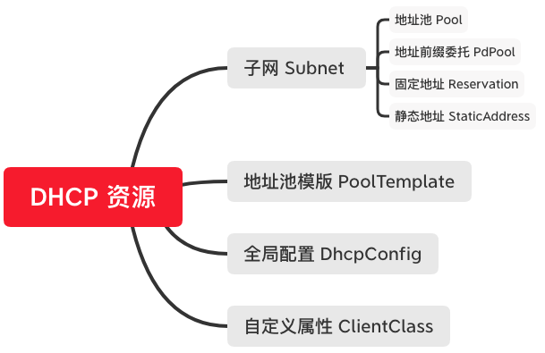

# DHCP
## 概要
为dhcp服务器提供配置接口，包含子网（Subnet）、全局配置（DhcpConfig）、自定义属性（ClientClass）， 子网包含地址池（Pool）、地址前缀委托（PdPool）、固定地址（Reservation）、静态地址（StaticAddress）、地址池模版（PoolTemplate），除了地址池模版、静态地址和全局配置，其他配置信息经过有效性检查后保存到数据库， 并通过kafka下发给dhcp服务器

## 动机和目标
* 支持DHCPv4和DHCPv6子网、地址池、Option配置
* 支持全局配置、自定义属性配置
* 支持地址池模版

## 资源关系

## 详细设计
#### 全局配置 DhcpConfig
* dhcp模块的顶级资源，属性如下：
  * 最大租赁时间 maxValidLifetime
  * 最小租赁时间 minValidLifetime
  * 默认租赁时间 validLifetime
  * 域名服务器 domainServers
* 租赁时间，如果用户不配置，使用默认值，类型为整形，单位为秒
  * 最小租赁时间：默认值为3个小时，即10800
  * 最大租赁时间：默认值为4个小时，即14400
  * 默认租赁时间：默认值为4个小时，即14400
* 全局唯一，即数据库中只保存一份，list时会检查数据库中是否存在，不存在则使用默认值插入一个，如果存在，则直接返回
* 支持改、查，不支持增、删  
* 参数检查
  * 域名服务器的每个地址必须为有效的ip地址
  * 默认和最小／大租赁时间必须大于0，最小租赁时间不能大于最大租赁时间

#### 自定义属性 ClientClass
* dhcp模块的顶级资源，名字不支持修改，目前只支持相等判断，即option[vendor-class-identifier].text == 值，属性如下：
  * 名字 name
  * 值 regexp
* 如果想使用某个自定义属性作为子网选择的条件，在子网配置中输入该自定义属性的名字
* 支持增、删、改、查

#### 子网 Subnet
* dhcp模块的顶级资源，支持v4和v6，已管理的子网才能被dhcp用来创建和下发配置，属性如下：
  * 子网 subnet
  * 最大租赁时间 maxValidLifetime
  * 最小租赁时间 minValidLifetime
  * 默认租赁时间 validLifetime
  * 域名服务器 domainServers
  * 网关(v4) routers
  * 自定义属性 clientClass
  * 网卡名字 ifaceName
  * 中继路由地址 relayAgentAddresses
  * 中继路由网卡ID relayAgentInterfaceId
  * 子网标识 tags
  * 网络类型 networkType
  * 子网地址池容量 capacity
  * 子网地址使用量 usedCount
  * 子网地址使用率 usedRatio
  * 子网IP版本 version
* 支持增、删、改、查，其中子网不可以修改
* 参数检查
  * 子网必须为有效CIDR，ipv6的子网掩码必须大于64
  * 域名服务器／网关（v4）/中继路由地址的所有地址，必须为有效的ip地址
  * 自定义属性必须是已创建的，不存在则报错
  * 子网的租赁最小时间必须小于最大时间
* 子网使用率需要从dhcp服务器拿到子网的租赁信息计算
* 删除子网，数据库会同时删除子网的子资源信息，如地址池、前缀委托、固定地址和静态地址
* 支持查询过滤
  * subnet
  * version

#### 地址池模版 PoolTemplate
* dhcp的顶级资源，属性如下
  * 名字 name
  * 版本 version
  * 起始偏移量 beginOffset
  * 容量 capacity
  * 域名服务器 domainServers
  * 网关（v4) routers
  * 自定义属性 clientClass
  * 备注 comment
* 支持增、删、改、查, 其中名字和版本不可以修改
* 参数检查
  * 起始偏移量和容量范围
    * v4:（0，65535）
    * v6:（0，2147483647）
  * 域名服务器和网关（v4）的所有地址必须为有效ip地址
  * 自定义属性的值必须为已存在的自定义属性名字
* 查询过滤
  * version
  * name

#### 地址池 Pool
* 父资源为Subnet，支持v4和v6，属性如下：
  * 开始地址 beginAddress
  * 结束地址 endAddress
  * 域名服务器 domainServers
  * 网关（v4) routers
  * 自定义属性 clientClass
  * 地址池容量 capacity
  * 地址池使用率 usedRatio
  * 地址池使用量 usedCount
  * 地址池模版名字 template
  * IP版本 version
* 支持增、删、改、查，可更新字段：域名服务器、网关（v4）、自定义属性
* 参数检查
  * 如果template为空
    * 开始地址、结束地址必须为有效ip地址，地址版本一致，结束地址要大于开始地址，同时两个地址必须在子网的范围内
    * 域名服务器和网关（v4）的所有地址必须为有效ip地址
    * 自定义属性的值必须为已存在的自定义属性名字
  * 如果template不为空，地址池使用模版创建，模版的version和子网的version必须一致，使用模版创建的起始地址和结束地址也必须在子网的范围内
* 如果是v6，子网前缀长度小于64，只能用于创建地址前缀委托，不能创建动态地址池
* 新建的地址池不能与已存在的地址池、地址前缀委托、静态地址有交集
* 新建或者删除子网的地址池，会使用地址池的地址容量更新子网的地址容量
* 地址池使用率会根据dhcp服务器的租赁信息计算
* 支持Action：
  * 名字: valid_template
  * input: 
    * 地址池模版名字 template
  * output: 
    * 开始地址 beginAddress
    * 结束地址 endAddress

#### 前缀委托 PdPool
* 父资源为Subnet，只支持v6，属性如下：
  * 前缀 prefix
  * 前缀长度 prefixLen
  * 委托长度 delegatedLen
  * 域名服务器 domainServers
  * 自定义属性 clientClass
  * 前缀容量 capacity
* 支持增、删、改、查, 可更新字段：域名服务器，自定义属性
* 参数检查
  * 前缀必须为有效的ipv6地址，且必须在子网的范围内
  * 委托长度必须大于等于前缀长度，且两者都要小于128
  * 域名服务器中所有地址必须为有效的ip地址
  * 自定义属性的值必须为已存在的自定义属性的名字
  * 前缀委托不能和已存在的地址池、前缀委托、固定地址、静态地址有交集

#### 固定地址 Reservation
* 父资源为Subnet，支持v4和v6，属性如下：
  * mac地址 HwAddress
  * ip地址 IpAddress
  * 域名服务器 domainServers
  * 自定义属性 clientClass
  * 网关（v4）routers
  * 地址池容量 capacity
  * 地址池使用率 usedRatio
  * IP版本 version
* 支持增、删、改、查，可更新字段：域名服务器、网关（v4）、自定义属性
* 参数检查
  * mac地址必须为有效的mac地址，且在数据库中唯一
  * ip地址必须有效且在子网的范围内，且不能在已存在的前缀委托、静态地址有交集
  * 域名服务器和网关（v4）的每个地址都必须为有效的ip地址
* 如果ip地址在已存在的地址池中，则不增加子网的地址池容量，否则子网的地址池容量增加
* 删除固定地址，如果固定地址影响了子网地址池容量，则子网的地址池容量减少

#### 静态地址 StaticAddress
* 父资源为Subnet，支持v4和v6，属性如下
  * mac地址 HwAddress
  * ip地址 IpAddress
  * 地址容量 Capacity
  * IP版本 Version
* 支持增、删、查
* 静态地址和其它所有地址类型互斥
* 配置不会下发到DHCP服务器
* 增加或者删除会影响子网地址池容量

## 未来工作
* 支持更多的全局配置和自定义属性
