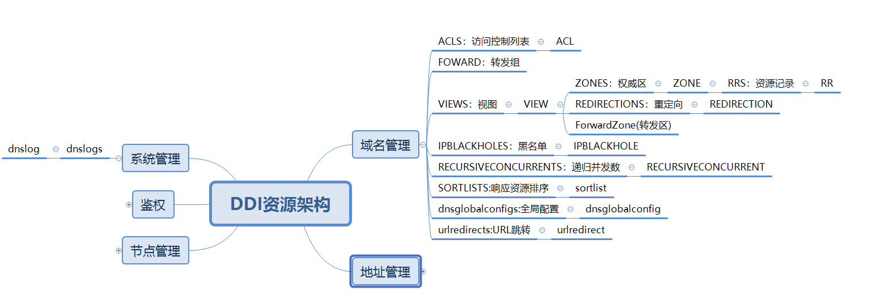

# DNS
## 概要
为dns服务器提供配置接口，包含访问控制列表（acl）、视图（view）、权威区（zone）、转发区（forwardzone）、 资源记录（rr）、dns64、转发组（forward）、
重定向（redirection）、dns访问日志开关（log），配置信息经过有效性检查后保存到数据库， 并通过kafka下发给dns服务器

## 动机和目标
* 支持DNS域名v4和v6的IP解析,支持信息按视图路线查询返回.

## 资源关系


## 详细设计
#### 访问控制列表 ACL
* dns模块的顶级资源，主要用于设置ip集合范围,该ip集合可用限制某些功能的使用范围.
* acl的内容为ip或者ip网段的集合,或者可以是单独的运营商.运营商有三个,cmcc,cucc,ctcc.分别表示中国移动,中国联通,中国电信.
* acl全局可用，即定义后在所有地方都可用使用.
* 存在默认的any和none两个acl,不可修改和删除.
* acl属性ip支持非操作.
* 支持增删改查.  
* acl的id和名字一致.
* 支持导入导出acl信息。

#### 视图 View
* dns模块的顶级资源，名字不支持修改,通过和acl集合绑定,表示某个范围内的用户群体,属性有优先级,DNS64前缀,acl列表.
* 视图有一个不能删除的默认视图default.视图有优先级,1级为最高优先级,用户定义的优先级可用调整.default总是为最低优先级.
* 视图的名字和ID一致.
* DNS64格式为：2001::/64
* 支持增、删、改、查
* 注意:acl互斥原则，不能同时选择any和none两个acl。
* 支持切换递归开关以及视图优先级别调整。这两个都是单独的action独立调用。
* 每个视图自己的递归开关会覆盖全局的递归开关，例如全局的递归是开启的，但是v1视图的是关闭的，那么只会影响到v1视图的递归但不会影响其他的视图。

#### 权威区 Zone
* Zone属于View模块下的资源，用于管理某个域名解析的配置集合。
* 权威区下分为正向解析域名和反向解析域名。
* 反向区用于通过IP地址反向解析域名，其创建的格式为:IP+前缀长度，例如：10.0.0.1/24或者2008::1/24。目前前缀长度支持8/16/24。
* 支持增、删、改、查。
* 区的TTL默认为3600，该值影响该区下的资源记录的TTL，修改该值会更新本区内的所有的资源记录的TTL。
* 同一视图内权威区名字不能相同,且权威区名字不能修改。

#### 资源记录 Rr
* 父资源为Zone，支持v4和v6，资源类型包含A|AAAA|CNAME|HINFO|MX|NS|NAPTR|PTR|SRV|TXT
* 支持增、删、改、查
* 删除区的时候,会将下面所有的资源自动删除
* TTL默认为区的ttl值。如果全局配置修改了ttl那么所有的区以及资源都会更新ttl。
* 记录名支持：英文字母或者数字，但数字不能单独出现；*以及@表示本区。
* A类型：记录值为IPV4，用于域名最终指向IP绑定，记录值只能输入IP格式：例如:10.0.0.2；
注意：在删除A记录时候会检测是否有绑定CNAME或者NS以及MX，如果有绑定则必须先删除CNAME、NS、MX以后才能删除A记录。
* AAAA类型：记录值为IPV6，用于域名最终指向IPV6记录。记录值只能是IPV6格式，例如:2008::2；
注意：在删除AAAA记录时候会检测是否有绑定CNAME或者NS以及MX，如果有绑定则必须先删除CNAME、NS、MX以后才能删除AAAA记录。
* CNAME类型：别名记录，即将形如a.com域名指向到b.com域名，从而达到转发的目的。其记录值为域名。
注意：如果记录值为本区的域名，那么提前存在该记录值，否则无法添加，如果记录值是非本区的域名不受此限制。
* HINFO类型：表示主机host information记录，罗列主机的硬件以及操作系统相关信息。记录值为两个字符串，例如:"INTEL-386" "WIN32"。
* MX类型：邮件交换记录。用于路由SMTP邮件传输，其记录值为:10 mx.zone.com；其中10表示优先级，值越大优先级越高。
注意：MX类型与CNAME一样，记录值如果是本区的资源记录，那么必须提前存在，并且其记录值类型不能是CNAME，只能是A或者AAAA。
* NS类型：用于指向权威区服务器，即表示该记录由那个服务器解析。其值为域名，例如：zone.com。
注意：NS指向只能是域名，并且该域名只能是A或者AAAA记录类型，并且创建时该记录值需提前存在，否则会创建失败。
* NAPTR类型：权威区指针，用于指向其余权威根区,其格式为:10 0       "s"     "SIPS+D2T"  "" _sips._tcp.domain.com. 。
* PTR类型:用于反向解析IP地址。格式为:1.0.0.10.in-addr.arpa PTR host.example.microsoft.com。
* SRV类型：一般是为Microsoft的活动目录设置时的应用。为了活动目录能够正常的工作，DNS服务器必须支持服务定位（SRV）资源记录，
资源记录把服务名字映射为提供服务的服务器名字。活动目录客户和域控制器使用SRV资源记录决定域控制器的IP地址。
其记录值为:优先级+空格+权重+空格+端口+空格+主机名，例如：10 10 889 host.ww.host.cc
* TXT类型：用于记录主机信息。记录值为字符串即可。

#### 重定向 Redirection
* 父资源为View，支持v4，属性包含区名称,ttl,数据类型,数据值,重定向方式.
* 支持增、删、改、查
* 重定向的域名没有通配功能.
* 重定向方式支持强制重定向与nxdomain。
* 强制重定向表示：权威区配置资源并且重定向也配置了的会优先走重定向。
* NXDOMAIN表示：该记录值的解析终止，该记录的查找不到而返回NXDOMAIN，而不是SERVERFAIL的错误。

#### DNS全局配置 dnsglobalconfigs
* 顶级资源:DNS日志开关（logEnable）、DNSSEC开关（dnssecEnable）、递归开关（recursionEnable）、递归并发数（recursiveClients）、
TTL（ttl）、黑名单开关（blackholeEnable）、黑名单列表（blackholes）。
* logEnable和ttl,分别表示用于是否dns服务的日志和设置全局DNS的ttl时间。
* 黑名单只有在开启的情况下，才会将列表中的IP或者前缀写入named文件中。如果黑名单开启但是列表为空也不会下入文件中。
并且列表支持的格式为IP或者IP网段，例如：10.0.0.2、10.0.0.0/24、2008::/64、2008::193。
* 接口只支持修改、查询.
* 默认值：logEnable默认值为true,ttl默认值为3600,recursionEnable为true,recursiveClients默认为1000,blackholeEnable默认关闭。
* 注意递归开关recursionEnable的规则。其影响的只是权威区里没有的域名解析，如果权威区里有域名，那不管递归开或者关都不影响正常解析。
例如权威区里有r1.zone.com，但是没有www.baidu.com，那么如果递归关闭r1.zone.com可以解析，但是www.baidu.com则会返回REFUSED.
另外就是递归开关也会影响转发。如果递归关闭，那么也不会走转发。
* 全局配置更新参数(updateModel)，系统会根据传入的枚举进行选择性更新:
```text
"log", DNS日志开关,对应参数：logEnable
"ttl",更新DNS全局TTL时间，对应参数：ttl
"dnssec",DNSSEC开关，对应参数:dnssecEnable
"blackhole",DNS黑名单开关以及更新黑名单列表，对应参数:blackholeEnable,blackholes。
"recursion",更新DNS全局递归开关，对应参数:recursionEnable
"recursive",更新DNS递归并发数，对应参数为:recursiveClients
"transferPort"：对应参数：transferPort更新DNS主辅区同步传输端口:默认是53。
```

#### DNS URL跳转 urlredirects
* DNS的views下的资源，通过设置一个已知的域名,和一个需要跳转的url,当客户访问域名的时候,能够自动跳转访问url的内容.
urlredirect资源包含了一个域名和一个url项.两者都是必填项.一个域名只允许设置一个url跳转.暂时不考虑不同视图有相同的域名做跳转的场景.
* 接口支持增删改查.

#### 解析日志 dnslogs
* log模块下的顶级资源，可以通过日期过滤查询结果,也可以使用ip作为过滤结果.在相同过滤条件下,导出的内容和查询结果内容一致.
* 接口只支持查询和导出功能.
