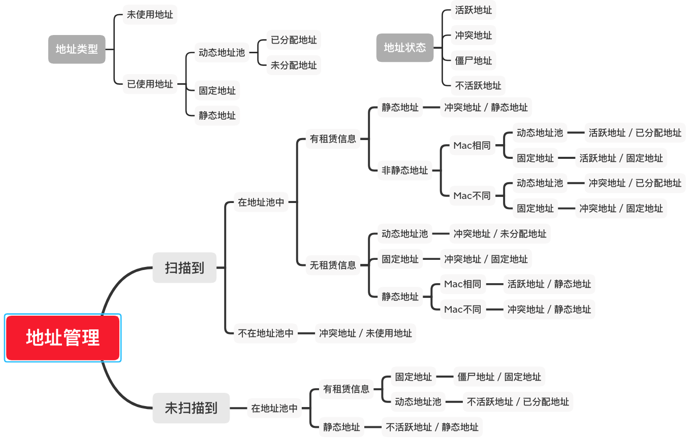

# 地址管理
## 概要
包含设备管理NetworkEquipment、终端管理Asset、扫描的子网ScannedSubnet、网络接口NetworkInterface、IP资产IpAsset、设备资产DeviceAsset, 其中，子网扫描结果会保存到AuditAsset表中，终端状态以及IP资产和设备资产信息都来源于AuditAsset表

## 地址类型和地址状态
* 地址类型
  * 未管理地址: 不在IPAM中配置的子网地址
  * 已管理地址: IPAM中已配置子网中的地址
    * 动态地址
      * 已分配地址：动态地址池中，已经分配出去且未到期的的地址
      * 未分配地址：动态地址池中，没有租赁信息或者已经过期的地址
    * 固定地址：由dhcp server分配的，与MAC绑定的地址
    * 静态地址：由管理员手动配置，与MAC绑定的地址
    * 未使用地址：在子网中但是没有在地址池中的地址
* 地址状态
  * 活跃地址：
    * 可以扫描到，在DHCP中有租赁信息，且扫描的IP对应的MAC，与租赁信息的MAC一致
    * 可以扫描到，在DHCP中没有租赁信息，且地址类型为静态地址
  * 冲突地址：
    * 可以扫描到，在DHCP中有租赁信息，但是地址类型为静态地址
    * 可以扫描到，在DHCP中有租赁信息，且扫描的IP对应的MAC，与租赁信息的MAC不一致
    * 可以扫描到，但DHCP中没有租赁信息，且不是静态地址
    * 可以扫描到，但是不在地址池中的地址
  * 僵尸地址：扫描不到，但是DHCP中有租赁信息，且属于固定地址的地址
  * 不活跃地址：
    * 扫描不到，但是DHCP中有租赁信息，且属于动态地址池的地址
    * 扫描不到，地址类型为静态地址
* 地址类型与地址状态逻辑导图如下：

## 详情设计
### 设备管理 NetworkEquipment 
* ipam模块的顶级资源，字段包含:
  * 设备名字 name
  * 管理地址 administrationAddress
  * 设备类型 equipmentType
  * 厂商 manufacturer
  * 序列号 serialNumber
  * 固件版本FirmwareVersion
  * 上联地址uplinkAddresses
  * 下联地址downlinkAddresses
  * 下一跳地址nextHopAddresses
  * 机房computerRoom
  * 机柜computerRack
  * 位置location
  * 所属部门department
  * 负责人responsiblePerson
  * 联系电话telephone
  * SNMP团体名 snmpCommunity
  * 上次扫描时间lastRefreshTime
  * 设备MAC administrationMac
* 设备类型equipmentType支持：
  * 路由器 router
  * 安全网关 security_gateway
  * 核心交换机 core_switch
  * 接入交换机 access_switch
  * 汇聚交换机 convergence_switch
  * 防火墙 firewall
  * 无线AP wireless_ap
  * 无线AC wireless_ac
  * 其它 other
* 支持增、删、改、查
* 支持修改的字段为:
  * 管理地址 administrationAddress
  * 设备类型 equipmentType
  * 厂商 manufacturer
  * 序列号 serialNumber
  * 固件版本FirmwareVersion
  * 机房computerRoom
  * 机柜computerRack
  * 位置location
  * 所属部门department
  * 负责人responsiblePerson
  * 联系电话telephone
  * 设备MAC administrationMac
* 支持过滤字段为：
  * 设备名称 name
  * 管理地址 administration_address
  * 设备类型 equipment_type
  * 厂商 manufacturer
* 支持动作：
  * action=snmp
    * 入参：（有V3标志的仅对于v3版本的SNMP有效）
      * snmpEnabled: SNMP开关
      * snmpCommunity：SNMP团体名，当snmpEnabled是true时，此字段必填
      * snmpVersion: SNMP 版本，支持v2c和v3，当snmpEnabled是true时，此字段必填
      * snmpV3UserName: SNMP v3 用户名，当snmpVersion是v3，此字段为必填
      * snmpV3MsgFlag: SNMP v3 安全级别，当snmpVersion是v3，此字段为必填，支持以下安全级别
        * 不认证不加密：no_auth_no_priv
        * 认证不加密：auth_no_priv
        * 认证且加密：auth_priv
      * snmpV3AuthenticationProtocol: 当snmpV3MsgFlag 是认证不加密或者认证且加密，此字段为必填，需要添加认证协议，支持以下协议
        * MD5
        * SHA
        * SHA224
        * SHA256
        * SHA384
        * SHA512
      * snmpV3AuthenticationPassphrase: 认证密码，当snmpV3AuthenticationProtocol配置后，此字段必填 
      * snmpV3PrivacyProtocol: 当snmpV3MsgFlag 是认证且加密，此字段为必填，需要添加认证协议，支持以下协议
        * DES
        * AES
        * AES192
        * AES256
        * AES192C
        * AES256C
      * snmpV3PrivacyPassphrase: 加密密码，当snmpV3PrivacyProtocol配置后，此字段必填
  * action=exportcsvtemplate
    * 出参：
      * path: 模版文件的绝对路径 
  * action=importcsv
    * 入参：
      * name: 导入文件的名字, 必填参数设备名字、管理地址、设备类型、设备Mac
  * action=exportcsv
    * 出参：
      * path: 导出文件的绝对路径

### 终端管理 Asset
* ipam模块的顶级资源，字段包含:
  * 终端名字 name
  * 终端状态 deviceState
  * Mac地址 mac
  * IPv4地址 ipv4s
  * IPv6地址 ipv6s
  * IPv4地址状态 ipv4sStatus
  * IPv6地址状态 ipv6sStatus
  * 终端类型 deviceType
  * 部署服务 deployedService
  * 机房computerRoom
  * 机柜computerRack
  * 上联设备 uplinkEquipment
  * 上联设备端口 uplinkPort
  * Mac地址所在Vlan的ID vlanId
  * 所属部门 department
  * 负责人responsiblePerson
  * 联系电话 telephone
* 终端类型deviceType支持：
  * 主机 pc
  * 移动设备 mobile
  * 打印机 printer
  * 摄像机camera
  * 网络视频录像机nvr
  * 物联设备iot
  * 其它 other
* 终端状态：
  * 状态包含：
    * 在线 online: 终端所有地址的IpState都是active的状态
    * 离线 offline：终端所有地址的IpState都是inactive或者zombie
    * 异常 abnormal：不属于online和offline的都是异常状态
  * 信息来源于审计终端AuditAsset表、状态字段ipv4sStatus／ipv6sStatus类型为一个对象数组ipStatus，只读，每个对象包含的字段：
    * 终端地址 ip 
    * 终端地址状态 ipState
    * 子网ID subnetId
    * 子网网段信息 ipnet
    * 对应NetworkInterface资源的链接 link，通过Link可以跳转到NetworkInterface资源页面查看该地址的更多信息，如subnetId＝1的对应的NetworkInterface的链接结构： api.Group+api.Version+/scannedsubnets/1/networkinterfaces?subnet=10.0.0.0/24
* 支持增、删、改、查
* 获取支持过滤字段：
  * 终端名字：name
  * 终端状态：device_state
  * MAC地址：mac
  * IP地址：ip
  * 上联设备：uplink_equipment
* 支持动作: 
  * action=refresh
    * 参数为
      * IP地址: ip
      * Mac地址所在Vlan的ID: vlanId
      * 地址所在的子网: subnet
      * 机房: computerRoom
      * 机柜: computerRack
      * 上联网络设备: uplinkEquipment
      * 上联设备端口: uplinkPort
    * 限制一个mac地址，在一个子网中只有一个ip，但是有个缺陷，用户输入时未指定终端地址所属于的子网信息，如10.0.0.8可能属于10.0.0.0/8或者10.0.0.0/16或者10.0.0.0/24，目前逻辑还没有做精确匹配，改进方案为让入参携带子网信息，如10.0.0.8/8或10.0.0.8/16或10.0.0.8/24
    * ip如果是v4地址，会更新到ipv4s, 如果是v6地址，会更新到ipv6s，更新的逻辑就是如果找到subnetId对应的ip就替换，如果没有找到，就添加到列表中
  * action=exportcsvtemplate
    * 出参：
      * path: 模版文件存储的绝对路径 
  * action=importcsv
    * 入参：
      * name: 导入文件的名字, 必填参数终端名字、Mac地址
  * action=exportcsv
    * 出参：
      * path: 导出文件存储的绝对路径

### 扫描子网 ScannedSubnet
* ipam模块的顶级资源，字段包含:
  * 网段 subnet
  * 标志 tags
  * 已分配比率 assignedRatio
  * 未分配比率 unassignedRatio
  * 固定地址比率 reservationRatio
  * 静态地址比率 staticAddressRatio
  * 未使用地址比率 unusedRatio
  * 活跃地址比率 activeRatio
  * 不活跃地址比率 inactiveRatio
  * 冲突地址比率 conflictRatio
  * 僵尸地址比率 zombieRatio
  * 子网来源 source, 枚举类型，包含dhcp、ipam、snmp 
* 其中地址类型比率：assignedRatio、unassignedRatio、reservationRatio、staticAddressRatio，他们的分母是四个总和，unusedRatio 分子为地址池外的所有地址，分母为子网所有地址
* 地址状态比率：activeRatio、inactiveRatio、conflictRatio、zombieRatio，他们的分母是四种状态地址的总和
* 扫描到的子网来源
  * dhcp: 配置在DHCP地址池管理
  * ipam: 配置在IPAM子网管理
  * snmp: 不在IPAM子网管理中，但是snmp扫描到了，这类子网为未管理子网，ip类型为未管理地址，ip状态为冲突地址，ip的所有操作禁用，即不能登机终端，不能转固定和静态
* 支持获取
* 支持动作：action=exportcsv，导出文件的表头为：IP地址, MAC地址, 地址类型, 地址状态, 租赁时间, 租赁过期时间，文件名字格式：subnet-{subnetId}-timestamp.csv
  * Output：
    * path: 类型为string，表示文件存储的绝对路径
* 子网扫描间隔默认为300秒，可以配置config->subnet_scan->interval
* 子网扫描逻辑
  * mib表
    * ipv4AddressPrefix          = ".1.3.6.1.2.1.4.34.1.5.1.4"
    * ipv6AddressPrefix          = ".1.3.6.1.2.1.4.34.1.5.2.16"
    * ipNetToPhysicalPhysAddress = ".1.3.6.1.2.1.4.35.1.4"
    * ipv4AdEntNetMask          = ".1.3.6.1.2.1.4.20.1.3"
    * ipv4NetToMediaPhysAddress = ".1.3.6.1.2.1.4.22.1.2"
    * ipv6AddrPfxLength         = ".1.3.6.1.2.1.55.1.8.1.2"
    * ipv6NetToMediaPhysAddress = ".1.3.6.1.2.1.55.1.12.1.2"
    * dot1dTpFdbPort       = ".1.3.6.1.2.1.17.4.3.1.2"
    * dot1dBasePortIfIndex = ".1.3.6.1.2.1.17.1.4.1.2"
    * ifName               = ".1.3.6.1.2.1.31.1.1.1.1"
    * dot1qPvid            = ".1.3.6.1.2.1.17.7.1.4.5.1.1"
    * ipRouteIfIndex = ".1.3.6.1.2.1.4.21.1.2"
    * ipRouteNextHop = ".1.3.6.1.2.1.4.21.1.7"
    * ipRouteType    = ".1.3.6.1.2.1.4.21.1.8"
    * ipCidrRouteNextHop = ".1.3.6.1.2.1.4.24.4.1.4"
    * ipCidrRouteIfIndex = ".1.3.6.1.2.1.4.24.4.1.5"
    * ipCidrRouteType    = ".1.3.6.1.2.1.4.24.4.1.6"
    * ipAdEntIfIndex = ".1.3.6.1.2.1.4.20.1.2"
    * ifPhysAddress  = ".1.3.6.1.2.1.2.2.1.6"
  * 扫描过程
    * 获取v4网段
      * 通过扫描ipv4AdEntNetMask表，获取v4网段信息
      * 如果未扫描到，扫描ipv4AddressPrefix表
      * 扫描ipv4NetToMediaPhysAddress表，获取在v4网段内的所有ip对应的mac
    * 获取v6网段
      * 通过扫描ipv6AddrPfxLength表，获取v6网段信息
      * 如果未扫描到，扫描ipv6AddressPrefix表
      * 扫描ipv6NetToMediaPhysAddress表，获取在v6网段内的所有ip对应的mac
    * 刷新v4和v6网段ip对应的mac: 可能ipv4NetToMediaPhysAddress和ipv6NetToMediaPhysAddress没有信息，通过扫描ipNetToPhysicalPhysAddress表，更新v4和v6的网段内的所有ip对应的mac
    * 获取网卡索引: 扫描dot1dBasePortIfIndex表，获取网卡对应的索引
    * 获取网卡名字: 扫描ifName表，获取网卡索引对应网卡名字
    * 获取Vlan: 扫描dot1qPvid表，获取网卡名字对应的Vlan Id
    * 获取网卡信息及网卡学到的Mac：
      * 扫描ifPhysAddress表，获取网卡名字对应的Mac地址
      * 扫描dot1dTpFdbPort表，获取网卡名字对应该网卡学到的Mac
      * 扫描ipAdEntIfIndex表，获取网卡索引对应的IP地址
    * 获取路由信息: 
      * 扫描ipRouteType、ipRouteNextHop、ipRouteIfIndex表，获取路由类型为4（indirect）对应的下一跳地址及对应的网卡名字
      * 如果没有获取到，扫描ipCidrRouteType、ipCidrRouteNextHop、ipCidrRouteIfIndex表获取
  * ip定位及端口类型确认: 目前只考虑连接到二层设备的终端
    * 遍历设备的所有端口
    * 如果某个端口学到了三层设备的Mac，设定为上联端口
    * 如果没有学到三层设备Mac，学到了其他二层设备的Mac，设定为下联端口
    * 如果即没有学到三层设备的Mac，也没有学到二层设备的Mac，设定为终端接入端口，即这个端口学到的Mac，表明终端和该二层设备直连
    * 如果某个端口只学到了三层设备的端口，表明该端口连接到三层设备，设定为下一跳端口
  * 网络层网络拓扑
    * 根据扫描的下一跳信息，对应寻找所有设备的管理地址
    * 如果通过设备的管理地址没找到，通过设备的端口地址查找下一跳对应的设备
  * 链路层网络拓扑
    * 遍历设备的所有端口
    * 如果端口类型为下一跳端口，通过三层设备的管理地址和端口地址，找到对应的上联地址对应的设备
    * 找寻所有相关联的设备，该设备的该端口学到的所有Mac对应的设备中，同时学到了该设备的管理地址或者某个端口地址，即为有相关联的设备
    * 遍历所有相关联的设备，如果该设备的该端口学到的所有Mac，与某一个相关联的设备的端口学到的所有Mac没有交集，表明两个设备直接连接，根据端口类型，更新上联和下联地址信息
  * 扫描结果
    * 将扫描到的子网中的IP和Mac注册或更新到AuditAsset表中保存
    * 更新终端管理信息，包含Asset的IP、位置信息、VlanId
      * 如果终端不包含扫描到的IP, 更新终端的信息信息
      * 如果终端包含扫描到的IP
        * 如果位置信息未更新，不更新终端信息
        * 如果新的位置信息不为空且发生变化，更新终端信息
* 非法DHCP扫描：默认扫描间隔为750秒
  * 扫描逻辑：
    * 获取当前节点所有global的IPv4地址网卡信息和linklocal、global的IPv6网卡信息
    * 对于IPv4，使用0.0.0.0作为源地址，68作为源端口，255.255.255.255作为目的地址，67作为目的端口，发送discover报文，将收到的所有offer的源ip与dhcp节点的ip做对比，不是来自dhcp节点的offer对应的server为非法dhcp
    * 对于IPv6，使用linklocal或者global的IPv6作为源地址，546作为源端口，ff02::1:2作为目的地址，547作为目的端口，发送solicit报文，将收到的所有advertise的源ip与dhcp节点的ipv6做对比，不是来自dhcp节点的advertise对应的server为非法dhcp
    * 将获取到的所有非法dhcp，其中mac地址为空的，尽量的在扫描到的子网中查询，然后向alarm模块发布告警信息
* 订阅dhcp模块subnet删除、pool的增删、reservation的增删、staticaddress的增删，ipam模块的ipbaseline的增删
  * subnet删除: 移除scannedsubnet中源为dhcp的subnet，删除相关ip基线信息
  * pool的增删、reservation的增删、staticaddress的增删: 更新scannedsubnet中源为dhcp的subnet的地址类型比率，更新相关networkinterface地址类型
  * ipbaseline的增删: 更新scannedsubnet源为dhcp的对应networkinterface的基线关联属性

### 网络接口 NetworkInterface
* 父资源为ScannedSubnet，数据保存在内存中, 字段包含
  * 接口地址 ip
  * 接口硬件地址 mac
  * 主机名 hostname
  * 租赁时间 validLifetime
  * 过期时间 expire
  * 地址类型 ipType
  * 地址状态 ipState
  * Mac地址所在Vlan的ID vlanId
  * 机房computerRoom
  * 机柜computerRack
  * 上联设备 uplinkEquipment
  * 上联设备端口 uplinkPort
  * IP基线是否关联 isIpBaseLineAssociated
* 地址类型：
  * 已分配地址 assigned
  * 未分配地址 unassigned
  * 固定地址   reservation
  * 静态地址   static
  * 未使用地址 unused
  * 未管理地址 unmanagered
* 地址状态：
  * 活跃地址   active
  * 不活跃地址 inactive
  * 冲突地址   conflict
  * 僵尸地址   zombie
* 只支持获取
  * filter
    * 支持ipstate、mac、ip，filter的modifier只支持eq，即：ipstate_eq=active或者ipstate=active
    * ipstate支持的有效值为active、inactive、conflict、zombie, 如果传的值不是有效值，返回空
* 地址类型转换
  * 可以转成静态地址：地址类型为未使用地址、地址状态为冲突地址
  * 可以转成固定地址：
    * 地址类型为未使用地址、地址状态为冲突地址
    * 地址类型为未分配地址、地址状态为冲突地址
    * 地址类型为已分配地址、地址状态为活跃地址
  * 不活跃的静态地址可以回收（删除）
* Action
  * createipbaseline  创建IP基线信息
  * deleteipbaseline  删除IP基线信息
  
### Ip资产 IpAsset
* ipam模块下ScannedSubnet的子资源，字段包含
  * ip地址 ip
  * ip地址被分配给哪些mac schedules，schedules为MacSchedule对象数组，包含
    * 硬件地址 mac
    * ip地址类型 ipType
    * ip地址状态 ipState
    * 获取时间 time
* 只支持获取，schedules按照时间time倒序排列
  * filter: 仅支持ip，filter的modifier只支持eq，即 ip=10.0.0.90 或者 ip_eq=10.0.0.90

### 设备资产 DeviceAsset
* ipam模块的顶级资源，字段包含
  * 硬件地址 mac
  * Mac地址分配到哪些ipv4 ipv4Schedules
  * Mac地址分配到哪些ipv6 ipv6Schedules
    * ipv4Schedules/ipv6Schedules为IpSchedule对象数组，包含
      * ip地址 ip
      * ip地址类型 ipType
      * ip地址状态 ipState
      * 分配时间 time
* 只支持获取，只能获取到终端管理 Asset 中已经存在的设备的ip分配历史信息，IpSchedule按照时间time倒序排列
  * filter: 仅支持mac，filter的modifier只支持eq，即 mac=40:23:43:82:1e:32 或者 mac_eq=40:23:43:82:1e:32

### IP基线 IpBaseLine
* ipam模块的顶级资源，字段包含
  * IP地址 ip
  * 硬件地址 mac
  * 地址类型 ipType
  * 上联设备 uplinkEquipment
  * 上联设备端口 uplinkPort
* 支持增、删、查
* 在NetworkInterface资源页面进行IP基线信息关联，即创建操作，已经关联的IP可以进行解除关联，即删除操作
* 只有固定地址或者静态地址可以做IP基线信息关联
