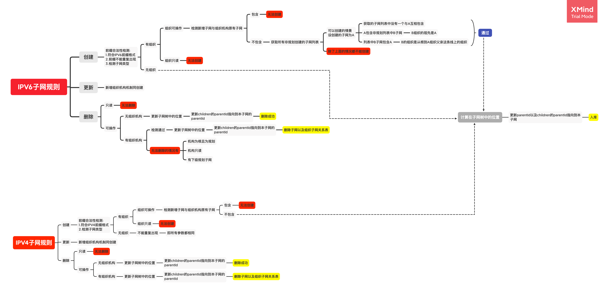

# IPAM模块

## 概要
新版IPAM模块包括:IP信息管理、组织结构、IPV6子网管理、IPV4子网管理、子网类型管理以及地址规划。地址规划都是基于组织结构，兼顾导入原有的子网与手动规划前缀。从而满足地址规划与使用。

## 组织结构 Semantic
* 顶级资源:
```text
| 参数名称              ｜ 数据类型      ｜ 备注                                                                        |
| -------------------- | -------------| ---------------------------------------------------------------------------|
| Name                 | string       | 组织的名称，必填参数，长度为1-255                                                 |
| ParentId             | string       | 父级组织的ID，根节点的父节点为空串                                                |
| RootId               | string       | 根组织的ID，用于区分不同的组织树。目前只有一个组织树，此ID为默认                       |
| Depth                | int          | 组织树的层级，用于限制组织机构最大不超过8级                                         |
| Path                 | string       | 用于储存组织的全路径，例如A>B>C。该值不存于数据库                                   |
| PathIds              | []string     | 用于存储组织的全路径ID，例如A.id>B.id>C.id，该值存于数据库，用于快速计算组织的全路径     |
| ReadOnly             | bool         | 是否只读，目前只用于下发以后的组织机构为true，标记true的组织机构是只读，不能进行修改编辑   |
| Dispatch             | *Dispatch    | 下发属性，如果该组织已经下发，则该属性不为空                                        |
```
* 支持操作：增、删、改、查以及导入导出。
* 支持action:
  * list_tree 根据根组织ID获取组织树
    * 入参:action链接上附带rootId，即可根据根组织获取整颗组织树。
    * 出参:组织机构列表。
  * create_subnode:创建子机构
    * 入参:
    ```text
    SemanticId:选中的组织ID
    SemanticNodes []*Semantic:需要创建的子组织的结构列表，这里由前端发起创建，后端根据前端传过来的组织列表生成组织。
    ```
    * 出参:httpStatus=200或者错误。
  * update_subnode:更新子机构名字
    * 入参:
     ```text
    SemanticId:选中的组织ID
    SemanticNodes []*Semantic:需要更新的子组织的结构列表
    ```
    * 出参:httpStatus=200或者错误。
  * delete_subnode:删除子机构
    * 入参:
    ```text
    SemanticId:选中的组织ID
    SemanticNodes []*Semantic:需要删除的子组织的结构列表
    ```
    * 出参:httpStatus=200或者错误。
* 限制
  1. 机构最多只允许有8级。
  2. 当机构有子节点，不能删除。
  3. 机构有IPV4子网或者IPV6子网，不能删除。
  4. 已经下发的机构不能删除。
* 备注
  根节点的RootId为:root
  
## IP信息管理 SemanticInfo
* 顶级资源，该资源是临时资源，不存储与数据库，而是通过组织机构表、组织机构与子网联合表以及子网表联合查询得出。
```text
Semantic    组织机构所有属性
NetworkV6s []*NetworkV6 组织机构的IPV6子网列表
NetworkV4s []*NetworkV4 组织机构的IPV4子网列表
```
* 支持操作：查
* 支持action:
  * list_semantic_info 获取IP信息管理列表。
    * 入参 根组织ID，填在URL上。
    * 出参 semanticTree:内容为SemanticInfo的数组。
  * list_v4 获取组织IPV4子网详情
    * 入参 semanticId:传入选中组织机构的ID
    * 出参 NetworkV4子网数组
  * list_v6 获取组织IPV6子网详情
    * 入参 semanticId:传入选中组织机构的ID
    * 出参 NetworkV6子网数组
  * search_semantic 模糊查询组织机构名称
    * 入参 name:查询组织机构的名称
    * 出参 semanticTree:内容为SemanticInfo的数组。
  * dispatch_forward
    * 入参 
    ```text
    RemoteAddr    string        下级系统的地址
    SemanticInfos SemanticInfos 选中的组织机构列表，这里只需要填入选中的组织机构ID即可。
    ```
    * 出参 httpStatus=200或者错误
  * repeal_forward
    * 入参 
    ```text
    RemoteAddr    string        下级系统的地址
    SemanticInfos SemanticInfos 选中的组织机构列表，这里只需要填入选中的组织机构ID即可。
    ```
    * 出参 httpStatus=200或者错误
  * report_forward
    * 入参 
    ```text
    RemoteAddr    string        下级系统的地址
    SemanticInfos SemanticInfos 选中的组织机构列表，这里只需要填入选中的组织机构ID即可。
    ```
    * 出参 httpStatus=200或者错误
* 规则约束
  * 下发上报约束
    * 下发组织必须是叶子组织，即该组织机构没有子组织。
    * 下发的组织必须带有子网，IPV4子网或者IPV6子网。
    * 可以重复下发，但是只能下发给同一个下级系统。
    * 当下级系统没有对组织进行操作（包括添加或者删除下级机构、子网）时可以进行撤回。
    * 下级系统可随时上报自己的组织机构以及组织机构附带的子网信息。
    
## IPV4子网 NetworkV4
* 顶级资源 NetworkV4
```text
| 参数名称              ｜ 数据类型      ｜ 备注                                                                            |
| -------------------- | ------------ | -------------------------------------------------------------------------------|
| Prefix               | string       ｜ 子网，必填
| Name                 | string       ｜ 子网名称
| SemanticName         | string       ｜ 组织机构名称，该值不入库，仅用于显示。显示格式为组织机构全路径:A>B>C
| SemanticId           | string       ｜ 组织机构ID，选填参数，也不入库，用于客户端选择组织机构唯一性判断。
| NetworkType          | string       ｜ 子网类型，选填参数，填入子网类型名称。
| CreateMode           | CreateMode   ｜ 子网创建方式，客户端非填参数，此参数值后端生成，目前有方式有plan（规划）、manual（手动创建）。
| Business             | string       ｜ 业务类型，选填。 
| Comment              | string       ｜ 备注
| Usage                | string       ｜ 管理占比率，用于计算子节点的占比率，公式为:子网个数/2^子网前缀长度
| ParentId             | string       ｜ 父节点的ID，用于定位该节点，如果父节点的ID为空串，表示该节点为根节点。
| PrefixIndex          | uint64       ｜ 子网前缀索引，用于存储该子网处于前缀的位置，规划时使用。
| Plan                 | string       ｜ 所属规划，该值不存入数据库，仅用于显示，但该值存入了组织子网联合表，用于区分不同的规划。如果时手动创建，则该值为空串。
| ReadOnly             | bool         ｜ 是否只读，如果该子网已经下发，或者时上报的，那么该子网为只读，只读的子网不能编辑、删除。
| DispatchUsage        | string       ｜ 下发子网使用率，下级系统上报的时候会附带此值，用于显示该子网在下级系统的使用情况。（此值为下级的dhcp使用率） 
```
* 支持操作：增、删、改、查、导入导出
* 支持action:importcsv、exportcsv、exportcsvtemplate即导入导出三件套
* 规则约束
  * ReadOnly=true只读的子网不能修改、删除。
  
  
## IPV6子网 NetworkV6
* 顶级资源 NetworkV6
* 数据类型与操作同IPV4子网

## 地址规划 Plan
* 顶级资源 Plan
```text
| 参数名称              ｜ 数据类型      ｜ 备注                                                                            |
| -------------------- | ------------ ｜ -------------------------------------------------------------------------------|
| Name                 | string       ｜ 规划名称，长度1-255
| Semantic             | string       ｜ 规划组织的ID，这里填的是根组织机构的ID。
| Prefixes             | []string     ｜ 规划前缀列表，该前缀可手填、也可以选择根组织已有的子网进行规划。
```

* 规划树子资源 PlanNode
```text
*SemanticInfo              IP信息资源，包含组织信息以及组织子网信息
PlanId       string        所属规划Id
SemanticPlan *SemanticPlan 规划信息，用于存储规划位宽、组织子网个数、子网起始值等信息
```

* 规划信息资源 SemanticPlan
```text
| 参数名称                   | 数据类型            | 备注                                                                            |
| ------------------------- | ----------------- | -------------------------------------------------------------------------------|
| Semantic                  | string            | 组织机构的ID，用于标识属于那个组织机构的规划详情
| Plan                      | string            | 所属规划ID，用于区分属于哪一个Plan规划
| BitWidth                  | int               | 位宽
| SubSemanticPrefixCount    | int               | 组织子网个数
| PrefixBeginValue          | string            | 组织子网起始值
| PrefixBeginIndex          | uint64            | 规划开始的位置，若子网起始值为空，因为跳过0位规划，所以该默认值为1
| RemainAddressCount        | uint64            | 前缀规划剩余地址数量
| PlanModel                 | PlanModel         | 规划类型，枚举值有:auto(一键规划)、custom(手动规划)、undefined(未规划)。
```

* 支持操作：增、删、改、查、导入导出
* 支持action:
  * list_plan_tree 获取规划树
    * 入参 传入规划Id，填入URL上
    * 出参 planTree:PlanNode的数组。
  * update_semantic_plan 更新位宽、组织子网个数、子网地址起始值
    * 入参 
    ```text
    PlanId                 string   规划ID，此参数填于url上 
    SemanticId             string   当前选中的组织机构的ID
    BitWidth               int      位宽
    SubSemanticPrefixCount int      组织子网个数，用于一键规划时每个子机构生成多少个子网
    PrefixBeginValue       string   组织子网起始值，例如2001:ff01::/32的前缀，起始值填ff01。这里的值得根据前缀规则计算填入，否则检测不通过。
    ```
    * 出参 httpStatus=200或者错误
  * get_plan_detail 获取规划信息，包括前缀信息、可规划数量、可规划范围、剩余可规划地址数量等信息。
    * 入参 
    ```text
    PlanId        string    规划ID，此参数填于url上
    SemanticId    string    当前选中的组织机构的ID
    SubSemanticId string    子机构ID，用于编辑时获取子机构规划信息
    ```
    * 出参 planDetails:PlanDetail的数组结构，多个规划前缀就有多条记录
    ```text
    PlanDetail结构：
    Prefix                string    IPV6前缀
    PrefixUsedCount       uint64    规划已使用数量
    RemainAddressCount    uint64    剩余可规划数量
    AddressAvailableScope string    可规划范围,例如:2001:20::/27~2001:e0::/27
    ```
  * plan_prefix_v6 一键规划｜手动规划
    * 入参 
    ```text
    Prefixs    []string     IPV6前缀，根据传入的前缀内容进行规划。
    ParentId   string       父组织机构节点ID
    SubNodeIds []string     规划子组织节点的ID数组
    PlanId     string       规划ID，此参数填于url上
    PlanModel  PlanModel    规划类型：auto(一键规划)、custom(手动规划)、undefined(未规划)
    ```
    * 出参 如果没有与前缀委派冲突，则出参为nil，否则会返回冲突的子网地址
    ```text
    State           AutoFormulateState 冲突状态：conflict
    ConflictSubnets []string           冲突子网地址
    ```
  * clean_prefix_v6 清空规划
    * 入参 结构同一键规划，但关键参数为ParentId以及SubNodeIds
    ```text
    Prefixs    []string     IPV6前缀，根据传入的前缀内容进行规划
    ParentId   string       父组织机构节点ID
    SubNodeIds []string     规划子组织节点的ID数组
    PlanId     string       规划ID，此参数填于url上
    PlanModel  PlanModel    规划类型：auto(一键规划)、custom(手动规划)、undefined(未规划)
    ```
    * 出参 httpStatus=200或者错误
  * update_prefix_v6 编辑
    * 入参 
    ```text
    Prefixs      []string   IPV6前缀，根据传入的前缀内容进行规划
    PrefixCounts []int      前缀规划的个数，可增可减。例如当前为3个，如果提交过来的值为2，那该机构的子网个数就减到2个
    ParentId     string     父组织机构节点ID
    SubNodeId    string     选中进行编辑的机构的ID
    PlanId       string     规划ID，此参数填于url上
    ```
    * 出参 如果没有与前缀委派冲突，则出参为nil，否则会返回冲突的子网地址
     ```text
     State           AutoFormulateState 冲突状态：conflict
     ConflictSubnets []string           冲突子网地址
     ```
  * plan_prefix_v6_ignore_conflict 前缀委派冲突时强制一键规划
    * 入参 传入参数同plan_prefix_v6，支持子网冲突时会加入告警信息。
    * 出参 httpStatus=200或者错误
  * update_prefix_v6_ignore_conflict 前缀委派冲突时强制编辑
    * 入参 传入参数同plan_prefix_v6，支持子网冲突时会加入告警信息。
    * 出参 httpStatus=200或者错误

## 组织子网联合表 SemanticNetwork
组织子网联合表，只用于后端组织机构与子网之间的关系维护，不作为前端资源。目前将组织机构、IPV4子网、IPV6子网、规划都解耦分为各自的表。
数据库里不存储其他信息，只用关系表来进行维护。
* 顶级资源
```text
| 参数名称                   | 数据类型            | 备注                                                                            |
| ------------------------- | ----------------- | -------------------------------------------------------------------------------|
| Semantic                  | string            | 组织机构ID
| NetworkId                 | string            ｜子网ID
| Version                   | util.IPVersion    ｜ 子网类型 6｜4
| Plan                      | string            ｜ 所属规划
```

## 子网类型管理 NetworkType
* 顶级资源
```text
Name                      string    必填，长度为1-255
Custom                    bool      区分系统类型还是手动创建类型，手动创建的为true，是可以编辑删除的，系统的无法操作
Comment                   string    备注
```
* 支持操作：增、删、改、查、导入、导出。

## 下发上报 Dispatch
* 顶级资源
```text
Semantic                  string    组织机构ID
IsSponsor                 bool      是否为上级，true为上级系统
RemoteAddr                string    下发的地址
```
* 该资源仅作为组织的一个附属信息，不单独想有增删改查操作

## 下发上报配置 DispatchConfig
* 顶级资源 DispatchConfig
```text
EnableReport              bool              是否开启上报
ReportServerAddr          string            上级系统服务器地址
EnableDispatch            bool              是否开启下发
DispatchClients           []*DispatchClient 下发服务器地址列表
```

* 二级资源 DispatchClient
```text
DispatchConfig            string  所属的下发上报配置ID
Name                      string  下级系统名称
ClientAddr                string  下级系统服务器地址
```

* 支持操作：增删改查
* 注意:
  * 只有EnableDispatch为true，并且DispatchClients列表不为空的时候才能下发。
  * EnableReport为true并且ReportServerAddr有值的情况下才能上报。